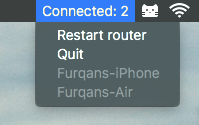

# Sharfoo
Sharfoo is a MacOS menu bar app that tracks the status of your TP-Link router

Tested on MacOS High Sierra and TP-Link TL-WR720N router with firmware version 4.19.56

### Installation
- Use 'sharfoo.app' in the build folder
- Copy it to your applications folder
- Set sharfoo to run at startup via System Preferences > Users &amp; Groups > Login Items
- When you run it for the first time you will be guided how to enter your router's admin credentials

### Development
- `pip install -r requirements.txt` to install python dependencies. I recommend using a virtual environment
- Use `python setup.py py2app` to build the standalone app
- Use `python sharfoo.py` to test the app

### Dependencies
This tool uses:
- [Rumps](https://github.com/jaredks/rumps)
- [Tippi-Link, a scraper the TP-Link admin portal](https://github.com/furqan-shakoor/tippi-link)

### Contribution
Feel free to contribute changes as pull requests. If you run into bugs, please raise them as Github issues